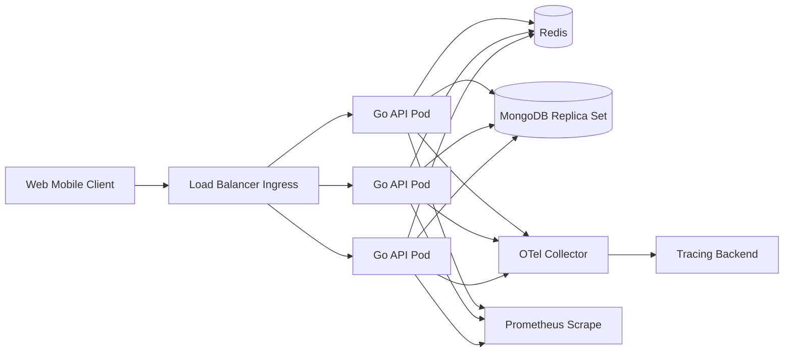
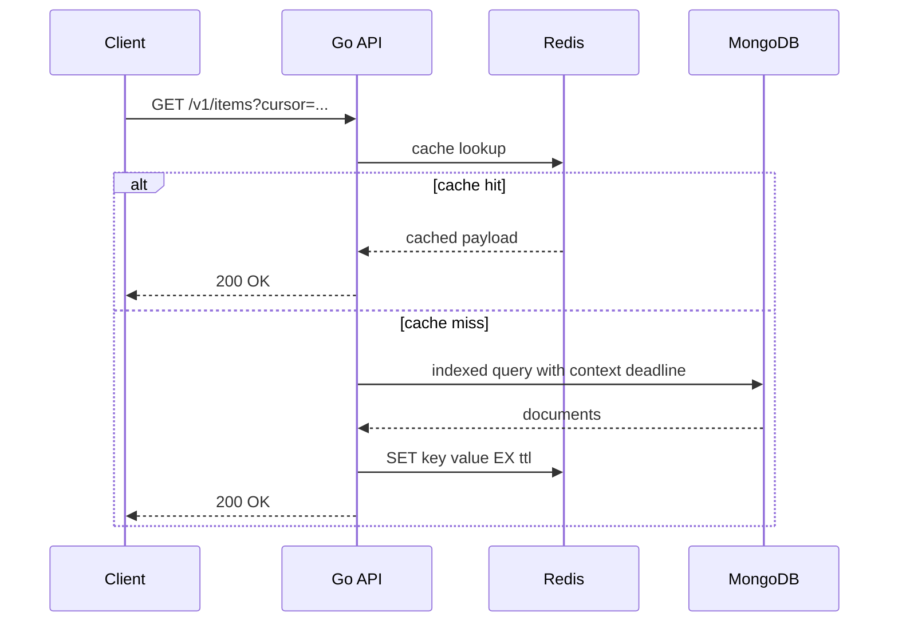

# Production-Ready Go and MongoDB REST API for 10,000 Concurrent Users

## Executive summary

A Go and MongoDB stack can support a production REST API serving **10,000 concurrent users**, but whether that is a modest, comfortable target or an expensive, high-risk target depends almost entirely on what “concurrent” means in practice. If it means 10,000 logged-in users with normal think time, the system may only need to sustain hundreds to a few thousand requests per second. If it means 10,000 simultaneous in-flight requests, the backend could need capacity in the tens of thousands of requests per second. Because the workload mix, document size, read/write ratio, and latency SLOs are unspecified, the correct architecture is not a single number but a set of design choices and validation gates. The most important conclusion is that **load testing and observability must drive the final sizing**, not framework marketing or synthetic microbenchmarks. citeturn31search0turn33search0turn1search0

For the HTTP layer, the highest-confidence recommendation is: use **`net/http`** if your team prefers the smallest dependency surface and is comfortable composing middleware; use **Gin** if you want the best balance of productivity, routing performance, middleware ecosystem, and operational familiarity; use **Echo** if you want a similarly lightweight framework with strong ergonomics; use **Fiber** only if you intentionally want the `fasthttp`-based model and accept its different semantics and interoperability trade-offs. Official framework documentation shows all three major frameworks emphasize radix-tree-style routing and middleware composition, while recent Gin benchmark pages place **Gin and Echo among the fastest routers** in GitHub-style route workloads and show **Fiber** competitive but not clearly superior in router-memory usage. citeturn8search0turn5search6turn3search4turn5search3turn4search0turn5search4turn7search0turn6search0

For MongoDB access, the default and safest production choice is the **official MongoDB Go driver**. It has explicit support for connection pools, retryable reads and writes, transactions, monitoring, and timeout propagation through `context.Context`. Thin ODMs such as **mgm** and **Qmgo** can reduce boilerplate, but they sit on top of the official driver and add abstraction overhead, additional upgrade risk, and sometimes weaker visibility into query shapes and performance. For a system targeting unpredictable concurrency, the official driver is the best first choice unless the domain model is unusually repetitive and the engineering team is already committed to a wrapper. citeturn13search6turn1search0turn13search0turn15search3turn15search4turn15search0

At the database layer, the principal throughput levers are **schema shape**, **indexes aligned to real query patterns**, and **pool sizing that matches pod-level concurrency**. MongoDB’s own guidance strongly favors avoiding schema anti-patterns such as unbounded arrays, bloated documents, excessive `$lookup`, and unnecessary indexes; it also recommends designing compound indexes with the **ESR guideline** so equality filters come first, then sort fields, then range fields unless a highly selective range should precede sort. Replica sets are the normal production baseline, while sharding is justified only when data volume or sustained throughput outgrows a single replica set and the shard key can distribute load evenly without hot chunks. citeturn9search4turn10search2turn11search1turn12search2turn12search6turn12search0

Operationally, the most robust baseline architecture is: stateless Go API pods behind a load balancer; Redis for cache and distributed rate limiting; a MongoDB replica set for the initial production tier; OpenTelemetry traces and metrics exported to a backend such as OTLP plus Prometheus scraping for service/process metrics; and Kubernetes horizontal scaling on resource and custom latency/queue signals. Multi-document MongoDB transactions should be used sparingly because MongoDB documents already provide atomicity at the document level and distributed transactions introduce lock, cache, and stale-read considerations. For authentication, short-lived bearer tokens and strict issuer/audience/signature validation are appropriate, while delegated access is better handled by an external OAuth2/OIDC provider than by custom token minting logic. citeturn19search4turn19search1turn13search0turn9search0turn21search2turn23search1turn23search0turn28search0turn28search2turn31search0

My recommended default stack for a new build is: **Gin + official MongoDB Go driver + Redis + OpenTelemetry + Prometheus + Kubernetes + MongoDB replica set**, with a deliberate path to sharding only after metrics prove the need. If the team strongly prefers fewer dependencies, switch Gin to **`net/http`** and keep everything else the same. citeturn5search6turn13search6turn19search4turn28search0turn28search2turn12search2

## Assumptions and technology choices

The key ambiguity is the workload model. Capacity planning must distinguish at least three cases: many idle or think-time-heavy users, sustained API traffic from active mobile/web clients, and true simultaneous in-flight requests during spikes. A practical way to reason about this is to model a few envelopes, then load-test all of them. That is more reliable than trying to “size for 10k users” as a single scalar. Kubernetes autoscaling and MongoDB pool behavior reinforce this point: both react to observed metrics and queueing, not user counts. citeturn31search0turn1search0turn33search0

### Framework comparison

| Option | Strengths | Weaknesses | Best fit |
|---|---|---|---|
| `net/http` | Standard library, lowest dependency risk, improved routing since Go 1.22, easiest long-term maintenance | More glue code for middleware, validation, and ergonomics | Teams optimizing for simplicity, control, and long service lifetime |
| Gin | Mature ecosystem, strong middleware support, fast radix-tree router, recent official benchmarks show top-tier routing performance | Extra dependency surface vs stdlib | Best general-purpose choice |
| Echo | Minimal and fast, optimized router, good built-in middleware | Smaller ecosystem than Gin | Strong alternative when you prefer its API style |
| Fiber | `fasthttp` foundation, high performance focus, broad built-in middleware | Different semantics from `net/http`, more care needed with value lifetimes and some integrations | Teams deliberately optimizing around Fiber’s ecosystem and semantics |

Go 1.22 added method matching and wildcards directly to `net/http.ServeMux`, reducing the historical need for a third-party router in many services. Gin documents a radix-tree router with zero-allocation route lookup and recently published benchmark results that rank Gin ahead of Echo in a representative GitHub-style routing benchmark; Echo similarly documents a radix-tree router with sync-pool-based memory reuse; Fiber documents its `fasthttp` base, zero-allocation focus, and a “batteries included” middleware ecosystem. The safest interpretation of these materials is that **raw router throughput is rarely the decisive bottleneck** in a MongoDB-backed API: database access patterns, BSON/JSON allocation, cache hit rate, and downstream latency dominate sooner. citeturn8search0turn8search2turn5search6turn3search2turn3search4turn5search3turn4search0turn5search4turn5search8turn7search0

### MongoDB driver and ODM comparison

| Option | Status | Strengths | Risks | Recommendation |
|---|---|---|---|---|
| Official MongoDB Go driver | First-party | Full feature support, pool controls, retryable reads/writes, sessions, monitoring, transactions | More verbose than ODMs | **Default choice** |
| mgm | Third-party ODM on official driver | Models, hooks, simplified CRUD | Abstraction overhead, smaller maintainer base | Use only if productivity gain is proven |
| Qmgo | Third-party wrapper on official driver | Easier migration from old `mgo`, chain-style API | Wrapper risk, upgrade lag potential | Acceptable for legacy migration, not my first choice for new high-scale systems |

MongoDB’s own docs center the official driver for connection management, CRUD, monitoring, and transactions. The GitHub READMEs for **mgm** and **Qmgo** explicitly state that they wrap the official driver rather than replace it. That means they do not remove the need to understand pools, indexes, timeouts, or query plans; they only hide some of the boilerplate. At 10k-user scale, that abstraction is helpful only if it does not weaken control over query paths and observability. citeturn13search6turn15search3turn15search4turn15search0

## Reference architecture and Go concurrency patterns

A robust baseline is a **stateless API tier** with request-scoped context, bounded concurrency for expensive internal work, Redis for cache and distributed limiters, and MongoDB as the source of record.



This shape matches Kubernetes’ scaling model for stateless pods, MongoDB’s client pool design, and Redis’ fit for cache-aside and distributed counters. The MongoDB Go driver maintains a per-server pool inside each client instance and explicitly recommends creating a client once per process and reusing it, rather than creating one per request. Redis’ cache-aside guidance similarly assumes the application checks cache first, falls back to the primary store on miss, and writes back with TTL. citeturn31search0turn31search2turn1search0turn19search1turn19search4

### Request sequence



For a write path, the same API should validate input, apply authentication/authorization, use an idempotency strategy where required, write to MongoDB with appropriate concern, and invalidate or update cached projections. RFC 9110 defines `PUT`, `DELETE`, and safe methods as idempotent; for create-like `POST` operations that may be retried by clients, the industry pattern is an idempotency key persisted in a deduplication store, even though the current `Idempotency-Key` header specification is still an IETF draft rather than a finished RFC. Problem responses should use `application/problem+json` so clients receive structured, machine-readable error details. citeturn26search0turn24search3turn25search0

### Go concurrency patterns that matter in production

The biggest concurrency mistake in Go APIs is not “too few goroutines”; it is **unbounded goroutines** that amplify queueing, memory pressure, and downstream contention. The Go blog’s pipeline guidance emphasizes fan-out, fan-in, cancellation, and making sure upstream goroutines can exit when downstream stops consuming. The `errgroup` package adds error propagation and shared-context cancellation; `errgroup.SetLimit` and `x/sync/semaphore` provide bounded parallelism; `singleflight` suppresses duplicate work for hot keys; and `x/time/rate` provides a safe token-bucket limiter for in-process rate control. citeturn17view0turn18search0turn18search1turn20search0turn2search0

The production implication is straightforward: use goroutines freely for short-lived request work, but **bound concurrency** for anything expensive or fan-out-heavy, such as batch enrichment, external HTTP calls, image transforms, or password hashing. In many REST APIs, a worker pool is best implemented not as a permanent fleet of idle workers, but with a semaphore or `errgroup.SetLimit` so concurrency is capped without adding a new queueing system. citeturn18search0turn18search1turn17view0

### Sample HTTP server and bounded-concurrency pattern

```go
package main

import (
	"context"
	"encoding/json"
	"errors"
	"log"
	"net/http"
	"os"
	"os/signal"
	"syscall"
	"time"

	"golang.org/x/sync/errgroup"
)

type problem struct {
	Type     string `json:"type,omitempty"`
	Title    string `json:"title"`
	Status   int    `json:"status"`
	Detail   string `json:"detail,omitempty"`
	Instance string `json:"instance,omitempty"`
}

func writeProblem(w http.ResponseWriter, r *http.Request, status int, title, detail string) {
	w.Header().Set("Content-Type", "application/problem+json")
	w.WriteHeader(status)
	_ = json.NewEncoder(w).Encode(problem{
		Type:     "about:blank",
		Title:    title,
		Status:   status,
		Detail:   detail,
		Instance: r.URL.Path,
	})
}

func boundedHandler(w http.ResponseWriter, r *http.Request) {
	ctx := r.Context()
	g, ctx := errgroup.WithContext(ctx)
	g.SetLimit(8) // start low; raise only after profiling and DB/pool validation

	// Example: bounded parallel sub-tasks.
	for i := 0; i < 8; i++ {
		i := i
		g.Go(func() error {
			select {
			case <-time.After(20 * time.Millisecond):
				_ = i // replace with actual work
				return nil
			case <-ctx.Done():
				return ctx.Err()
			}
		})
	}

	if err := g.Wait(); err != nil {
		writeProblem(w, r, http.StatusGatewayTimeout, "subtask failure", err.Error())
		return
	}

	w.Header().Set("Content-Type", "application/json")
	_ = json.NewEncoder(w).Encode(map[string]any{"ok": true})
}

func main() {
	mux := http.NewServeMux()
	mux.HandleFunc("GET /healthz", func(w http.ResponseWriter, r *http.Request) {
		w.WriteHeader(http.StatusOK)
		_, _ = w.Write([]byte("ok"))
	})
	mux.HandleFunc("GET /v1/work", boundedHandler)

	srv := &http.Server{
		Addr:              ":8080",
		Handler:           mux,
		ReadHeaderTimeout: 2 * time.Second,
		ReadTimeout:       10 * time.Second,
		WriteTimeout:      15 * time.Second,
		IdleTimeout:       60 * time.Second,
	}

	go func() {
		log.Printf("listening on %s", srv.Addr)
		if err := srv.ListenAndServe(); err != nil && !errors.Is(err, http.ErrServerClosed) {
			log.Fatalf("server failed: %v", err)
		}
	}()

	stop := make(chan os.Signal, 1)
	signal.Notify(stop, syscall.SIGTERM, syscall.SIGINT)
	<-stop

	ctx, cancel := context.WithTimeout(context.Background(), 20*time.Second)
	defer cancel()
	_ = srv.Shutdown(ctx)
}
```

This pattern intentionally leans on the Go 1.22+ standard router and request context cancellation. Go’s docs recommend propagating `context.Context` to cancel in-progress operations, especially database work when the client disconnects or a deadline expires. citeturn8search0turn2search1

## MongoDB schema design, indexing, consistency, and client tuning

MongoDB gets high throughput when the **hot path is document-local** and reads are supported by the right indexes. It slows down when frequently accessed documents become bloated, when arrays grow without bound, when too many indexes inflate write cost, or when logical joins via `$lookup` are overused. MongoDB’s schema anti-patterns documentation is explicit on all four points. For a REST API, that usually means embedding data that is read together and updated together, while referencing data that grows independently or must be shared across many roots. citeturn9search4turn10search2

For index design, create indexes from actual request shapes, not from field popularity. MongoDB’s **ESR guideline** is the most practical rule: put equality predicates first, then sort fields, then range fields unless a highly selective range should come before sort. Compound indexes work on exact field sets and prefixes, and every extra index carries write and storage cost. Partial indexes are especially valuable for high-throughput APIs because they shrink index size and update work by indexing only the subset of documents that matter for a query pattern. citeturn11search1turn10search4turn10search0turn10search2

### Schema and index guidance by endpoint type

| Endpoint pattern | Suggested schema/index shape | Why |
|---|---|---|
| `GET /items/{id}` | `_id` or stable unique business key | Fast point lookup |
| `GET /items?tenant=T&status=S&cursor=...` | Compound index like `{tenantId:1, status:1, createdAt:-1, _id:-1}` | Aligns equality + sort + cursor range |
| `GET /users/{id}/orders` | Orders collection with `{userId:1, createdAt:-1, _id:-1}` | Query-side fan-out without unbounded embedded arrays |
| Soft-delete reads | Partial index on active docs only | Smaller index, lower write overhead |
| TTL/session data | TTL index or Redis instead | Automatic expiry for ephemeral state |

The operational rule is: **design the API and its pagination model around indexable queries**. Cursor pagination is usually preferable to deep offset pagination because it maps naturally to indexed equality-plus-range scans. That design is not just an API nicety; it is often the difference between sustainable p95 latency and runaway tail latency at scale. The ESR guideline and compound-index prefix behavior are what make cursor pagination attractive in MongoDB-backed APIs. citeturn11search1turn10search4turn10search2

### Transactions and consistency

MongoDB guarantees atomicity at the single-document level. That is strong enough for many API operations if the domain model is shaped correctly. Multi-document transactions exist and are supported in the Go driver, but MongoDB’s own production guidance warns about transaction runtime limits, WiredTiger cache pressure, lock acquisition timeouts, stale reads within transactions, and added complexity on sharded clusters. The driver also states that sessions are not safe for concurrent use across goroutines and that parallel operations are not supported within a single transaction. citeturn13search0turn9search0

That leads to a clear recommendation:

- Prefer **single-document invariants** where possible.
- Use transactions for genuinely cross-document invariants such as ledger postings, reservation state changes, or atomic write bundles that cannot be remodeled.
- Keep transactions short, narrow, and infrequent.
- Do not run unrelated parallel work inside one transaction context. citeturn13search0turn9search0

Read and write concerns should be chosen per endpoint category, not globally by habit. MongoDB’s manuals explain that `readConcern: "local"` gives lower-latency reads with rollback risk, while stronger settings such as `"majority"` and `"linearizable"` trade availability and latency for stronger guarantees; causally consistent behavior depends on the right combination of read concern and write concern. In practice, most APIs use `"majority"` semantics only where business correctness requires them, and use lighter settings for non-critical reads. citeturn9search1turn9search3

### Client pooling and timeout tuning

MongoDB’s Go driver has a built-in pool **per server in the topology**. Defaults matter: `maxPoolSize` defaults to `100`, `minPoolSize` to `0`, `maxConnecting` to `2`, and each client instance opens monitoring sockets in addition to application connections. MongoDB explicitly recommends **one reused client per process**, not one client per request. It also documents `waitQueueTimeoutMS`, `serverSelectionTimeoutMS`, `connectTimeoutMS`, and the client-side operation timeout (`timeoutMS`) as the main knobs for protecting the application during spikes. Retryable reads and retryable writes are enabled by default in modern official drivers. citeturn1search0turn1search1turn1search5turn13search1turn13search2turn14search0

A production tuning starting point for a single API pod is:

- `maxPoolSize`: **150–300** for a 2–4 vCPU pod that handles bursty concurrent I/O
- `minPoolSize`: **10–30** for warm steady-state traffic
- `maxConnecting`: **4–8** to reduce cold-start pool ramp without creating connection storms
- `maxConnIdleTime`: **30s–120s**, chosen to stay below firewall/LB idle timeouts
- `serverSelectionTimeoutMS`: **3s–5s**
- `waitQueueTimeoutMS`: **100ms–1000ms** depending on whether you would rather fail fast or queue during spikes
- client `timeoutMS` or request-scoped context deadlines: **match endpoint SLOs**, not one blanket high value for everything

These are **recommended starting values**, not universal truths. They should be validated under load against your real pod counts, HPA behavior, and MongoDB node capacity. MongoDB’s docs provide the semantics for each option and the default values that make these recommendations meaningful. citeturn1search0turn1search1turn14search0turn14search7

### Sample MongoDB client and index setup

```go
package data

import (
	"context"
	"time"

	"go.mongodb.org/mongo-driver/v2/mongo"
	"go.mongodb.org/mongo-driver/v2/mongo/options"
	"go.mongodb.org/mongo-driver/v2/bson"
)

func NewClient(uri string) (*mongo.Client, error) {
	opts := options.Client().
		ApplyURI(uri).
		SetMaxPoolSize(200).
		SetMinPoolSize(20).
		SetMaxConnecting(6).
		SetMaxConnIdleTime(60 * time.Second).
		SetServerSelectionTimeout(5 * time.Second).
		SetTimeout(2 * time.Second) // client-side operation timeout baseline

	return mongo.Connect(opts)
}

func EnsureIndexes(ctx context.Context, coll *mongo.Collection) error {
	_, err := coll.Indexes().CreateMany(ctx, []mongo.IndexModel{
		{
			Keys: bson.D{
				{Key: "tenantId", Value: 1},
				{Key: "status", Value: 1},
				{Key: "createdAt", Value: -1},
				{Key: "_id", Value: -1},
			},
		},
		{
			Keys: bson.D{{Key: "expiresAt", Value: 1}}, // TTL index
			Options: options.Index().SetExpireAfterSeconds(0),
		},
		{
			Keys: bson.D{{Key: "email", Value: 1}},
			Options: options.Index().
				SetUnique(true).
				SetPartialFilterExpression(bson.D{{Key: "deletedAt", Value: bson.D{{Key: "$exists", Value: false}}}}),
		},
	})
	return err
}
```

## API behavior, security, caching, and observability

A production REST API needs predictable behavior under retry, overload, misuse, and partial failure. The best baseline is:

- **Cursor pagination** on large collections
- **Structured error responses** using RFC 9457
- **Idempotent semantics** for updates and deletes, and explicit idempotency for retryable creates
- **Authentication** via bearer tokens or external OAuth2/OIDC
- **Rate limiting** at both edge and application layers
- **Cache-aside** for hot reads
- Full-stack **metrics, logs, and traces** from ingress through MongoDB calls. citeturn25search0turn26search0turn23search1turn23search0turn19search1turn28search0turn28search2

### Authentication and rate limiting

JWTs are a compact claim format designed to fit HTTP authorization headers and URI/query contexts, and OAuth 2.0 defines the authorization framework and access-token model that delegates limited access without sharing the resource owner’s credentials. Bearer tokens, by definition, must be protected because possession is enough for use. In practice, that means short expiries, issuer and audience validation, signature verification against trusted keys, key rotation, and revocation or near-real-time expiry for sensitive scopes. citeturn21search2turn23search1turn23search0

For user authentication that you own, OWASP’s current cheat sheets recommend modern password hashing such as Argon2id, bcrypt, or PBKDF2 rather than fast hashes, and they provide concrete minimum parameter guidance. Password verification is computationally expensive by design, which is another reason login routes need stricter rate limits and possibly separate concurrency budgets from ordinary read APIs. OWASP’s API Security project and REST Security cheat sheet also underline risks around broken authentication, unrestricted resource consumption, unsafe content handling, and insecure defaults. citeturn22search0turn22search1turn21search0turn21search1turn24search5

A practical rate-limiting model is layered:

- **Ingress or gateway limit** per IP / token / route family
- **Application token-bucket limit** for cheap local protection using `x/time/rate`
- **Distributed Redis-backed limit** for horizontally scaled pods, especially on login, OTP, password reset, and expensive searches

Echo and Fiber both document built-in rate limiter middleware, but both default to in-memory behaviors that are not enough for multi-pod production on their own. Fiber explicitly notes its limiter does not share state across servers by default; Echo’s docs say the in-memory store is not the best option for very high concurrency or very large identifier sets. citeturn2search0turn5search0turn4search1turn19search2

### Caching strategy

Redis’ official cache-aside guidance matches a typical MongoDB-backed API very well: check Redis first, fall back to MongoDB on miss, write back with TTL, and use stampede protection. Redis also documents pipelining, transactions, TTL controls, and cluster support through its Go client ecosystem. For a 10k-user API, a good rule is to cache **expensive, mostly read, easily invalidated** objects: product summaries, user profiles, feature flags, policy documents, permission snapshots, and derived list pages whose invalidation story is clear. Do not cache objects whose correctness window is tighter than your invalidation path can guarantee. citeturn19search1turn19search4turn19search8turn19search2turn19search3

For hot-key protection inside the API process, combine Redis with `singleflight`. That prevents a thundering herd of identical misses from exploding into duplicate MongoDB queries. citeturn20search0turn19search1

```go
package cache

import (
	"context"
	"encoding/json"
	"time"

	"golang.org/x/sync/singleflight"
	"github.com/redis/go-redis/v9"
)

type Loader[T any] func(context.Context, string) (T, error)

var sf singleflight.Group

func GetOrLoad[T any](ctx context.Context, rdb *redis.Client, key string, ttl time.Duration, load Loader[T]) (T, error) {
	var zero T

	if s, err := rdb.Get(ctx, key).Result(); err == nil {
		var out T
		if json.Unmarshal([]byte(s), &out) == nil {
			return out, nil
		}
	}

	v, err, _ := sf.Do(key, func() (any, error) {
		out, err := load(ctx, key)
		if err != nil {
			return zero, err
		}
		b, _ := json.Marshal(out)
		_ = rdb.Set(ctx, key, b, ttl).Err()
		return out, nil
	})
	if err != nil {
		return zero, err
	}
	return v.(T), nil
}
```

### Error handling, pagination, and safe retries

RFC 9457 gives a standard JSON problem format for HTTP APIs. That is the right baseline for validation errors, authorization failures, downstream failures, and rate-limit denials because it lets clients reliably consume `type`, `title`, `status`, `detail`, and extension members. It also encourages a disciplined line between safe customer-facing detail and internal exception leakage. citeturn25search0

For updates, rely on HTTP semantics where possible: `PUT`, `DELETE`, and safe methods are already idempotent per RFC 9110. For create-like operations that clients may retry after network failure, persist a per-request idempotency key together with a request hash and the resulting resource reference or response envelope. The current `Idempotency-Key` header specification is still draft-stage, so I recommend treating the header name as a pragmatic interoperability choice rather than assuming final standards stability. citeturn26search0turn24search3turn24search4

### Observability

OpenTelemetry-Go is stable for traces and metrics, and OpenTelemetry’s semantic conventions define standard attributes for HTTP spans and metrics such as request duration and active requests. Prometheus’ Go client is the standard instrumentation package for service metrics in Go. MongoDB’s Go driver exposes command-started, command-succeeded, and command-failed events, and also exposes logging for command, topology, server selection, and connection components. Go’s diagnostics docs recommend using pprof, runtime metrics, and tracing carefully because some tools perturb the system and should be collected in isolation. citeturn28search0turn27search1turn27search3turn27search4turn28search2turn29search1turn29search0turn33search0turn33search1

At minimum, instrument:

- HTTP server request rate, error rate, p50/p95/p99 latency, active requests
- Request body size and response size where relevant
- MongoDB command latency by command name and collection
- MongoDB pool checkout wait, pool saturation, and timeout counts
- Redis hit rate, miss rate, command latency
- Goroutine count, GC pause, heap, CPU saturation
- Trace spans across inbound request, cache lookup, MongoDB query, and external calls. citeturn27search4turn29search1turn33search1

The most important operational insight is not “collect everything”; it is “collect enough to distinguish routing cost, queueing, cache miss, pool starvation, and database latency.” Without that separation, a 10k-user test will tell you the system is slow but not why. citeturn33search0turn29search1

## Validation plan, deployment model, and cost envelope

### Load-testing plan

The only credible way to validate 10k-concurrency support is with staged load tests that isolate CPU, memory, pool, and database behavior. Use **k6** for browser-like and API scenario scripting, especially open-model arrival-rate tests, and use **Vegeta** when you want precise constant-rate HTTP attack patterns and a Go-native toolchain. Go’s race detector and pprof should be part of the pre-production pipeline, not deferred until after performance incidents. citeturn32search0turn32search1turn32search2turn33search0

Recommended validation stages:

| Stage | Goal | What to watch |
|---|---|---|
| Baseline | Establish steady-state latency and error rate at low load | p95 latency, CPU, heap, DB latency |
| Ramp | Discover when queueing starts | active requests, Mongo pool waits, p99 latency |
| Spike | Test autoscaling and cold pool behavior | HPA lag, Redis saturation, connection storms |
| Soak | Detect leaks and long-tail instability | goroutines, heap growth, TTL churn, cache hit drift |
| Failure | Kill Redis/Mongo secondary/API pods | retry behavior, failover latency, error budgets |
| Chaos | Reduce capacity during load | graceful degradation, readiness behavior |

A critical nuance from k6’s docs is that **arrival-rate executors are open-model**: they start iterations independently of system response time. That is usually the right model for validating whether your API can hold an SLO under a target traffic rate, because it avoids masking coordinated omission and exposes true overload behavior sooner. Vegeta emphasizes constant request rate and explicitly advertises avoiding coordinated omission, making it a good second opinion for API-only throughput testing. citeturn32search0turn32search1

### Example k6 script for mixed traffic

```javascript
import http from 'k6/http';
import { check, sleep } from 'k6';

export const options = {
  scenarios: {
    read_mix: {
      executor: 'ramping-arrival-rate',
      startRate: 200,
      timeUnit: '1s',
      preAllocatedVUs: 300,
      maxVUs: 3000,
      stages: [
        { target: 500, duration: '5m' },
        { target: 1000, duration: '10m' },
        { target: 2000, duration: '10m' },
        { target: 500, duration: '5m' },
      ],
    },
  },
  thresholds: {
    http_req_failed: ['rate<0.01'],
    http_req_duration: ['p(95)<250', 'p(99)<600'],
  },
};

const BASE = __ENV.BASE_URL || 'https://api.example.com';

export default function () {
  const token = __ENV.BEARER_TOKEN;
  const params = {
    headers: {
      Authorization: `Bearer ${token}`,
      Accept: 'application/json',
    },
  };

  const r = Math.random();
  let res;

  if (r < 0.70) {
    res = http.get(`${BASE}/v1/items?tenant=t1&status=active&limit=20`, params);
  } else if (r < 0.90) {
    res = http.get(`${BASE}/v1/items/665f2d4d3d2d4e9b20d1a111`, params);
  } else {
    const idempotencyKey = crypto.randomUUID ? crypto.randomUUID() : `${__VU}-${__ITER}-${Date.now()}`;
    res = http.post(
      `${BASE}/v1/orders`,
      JSON.stringify({ sku: 'abc-123', qty: 1 }),
      {
        headers: {
          ...params.headers,
          'Content-Type': 'application/json',
          'Idempotency-Key': idempotencyKey,
        },
      }
    );
  }

  check(res, {
    'status ok': (r) => r.status >= 200 && r.status < 500, // app-level fail handling separately
  });

  sleep(Math.random() * 2); // think time to emulate users, not just nonstop bots
}
```

### Example Vegeta attack for steady write-rate validation

```bash
echo 'POST https://api.example.com/v1/orders
Authorization: Bearer TOKEN
Content-Type: application/json
Idempotency-Key: "loadtest-order-001"

{"sku":"abc-123","qty":1}' \
| vegeta attack -rate=300 -duration=5m \
| tee results.bin \
| vegeta report
```

### Deployment choices

| Option | Pros | Cons | When to use |
|---|---|---|---|
| Single VM + systemd | Lowest ops complexity | Weak elasticity, manual failover | Early internal workloads only |
| Containers on a small orchestrator | Better packaging than VM-only | Limited autoscaling and resilience | Small teams, modest traffic |
| Kubernetes + MongoDB replica set | Strong scaling, health probes, HPA, standard deployment model | Higher operational complexity | Best default for serious production |
| Kubernetes + sharded MongoDB | Horizontal DB scale, targeted routing on shard key | Larger blast radius, shard-key design risk | Only after proven replica-set saturation |

Docker’s multi-stage builds reduce final image size and attack surface by copying only the compiled artifact into the runtime image. Kubernetes readiness, liveness, and startup probes control traffic routing and restart behavior. HPA scales pods based on resource or custom metrics, but it acts as a control loop and therefore reacts with delay; that means sudden spikes still need headroom, not pure faith in autoscaling. Resource requests and limits should be set explicitly per container because HPA and scheduling decisions depend on them. citeturn30search0turn30search1turn30search3turn31search0turn31search2

A sound production stance is:

- Multi-stage Go image
- One process per container
- Readiness probe hits a cheap dependency-light endpoint
- Startup probe protects cold start
- Liveness probe only for deadlock or unrecoverable stuck-state detection
- HPA on CPU **plus** a latency or active-request custom metric if available
- MongoDB replica set with three data-bearing members as the baseline. citeturn30search0turn30search3turn31search0turn12search2

### Illustrative cost and resource envelope

The following estimates are **not guarantees**. They are planning envelopes meant to show how strongly costs depend on the real traffic profile.

| Scenario | Interpreting 10k users | API tier | Redis tier | MongoDB tier | Likely notes |
|---|---|---|---|---|---|
| Light read-heavy | 10k signed-in users, 300–800 RPS | 3–6 pods, 2 vCPU, 1–2 GiB each | 1 primary + replica, 1–2 vCPU, 2 GiB | 3-node replica set, 4 vCPU, 16 GiB each | Very achievable if cache hit rate is good |
| Mixed business API | 10k active users, 1k–3k RPS | 6–12 pods, 2 vCPU, 2 GiB each | 3 nodes, 2 vCPU, 4 GiB each | 3-node replica set, 8 vCPU, 32 GiB each | Most common serious production envelope |
| Aggressive high-concurrency | 10k near-simultaneous requests, 10k+ RPS | 20–50 pods, 2–4 vCPU, 2–4 GiB each | 3–6 nodes or Redis Cluster | 2–4 Mongo shards plus replica sets, 8–16 vCPU, 32–64 GiB per node | This is a materially different class of system |

These estimates follow from the documented realities that Kubernetes scales pods based on observed load and configured requests, MongoDB clients multiplex request concurrency through per-server pools whose defaults are modest, and sharding is the main MongoDB mechanism for exceeding a single server or replica-set throughput ceiling. The most important missing input is storage behavior: if the working set fits in RAM and most reads are indexed, IOPS needs are moderate; if not, IOPS become the dominant cost driver quickly. citeturn31search0turn31search2turn1search0turn12search6

As a practical budgeting heuristic, many teams should expect the **API tier to be cheaper than the database tier** once the service is successful. Go is usually efficient enough that stateless compute scales linearly and predictably; MongoDB storage, RAM for working set, and failover headroom become the expensive part sooner. That is another reason to invest early in cache hit rate, schema discipline, and index hygiene. citeturn10search2turn9search4turn12search6

## Recommended baseline configuration

If I had to choose one production baseline for this project with the current information, it would be this:

- **HTTP framework:** Gin  
- **Go version:** current stable release used consistently across build/test/runtime  
- **Database driver:** official MongoDB Go driver  
- **MongoDB topology:** three-node replica set to start  
- **Cache and distributed limiter:** Redis  
- **Containerization:** multi-stage Docker build  
- **Orchestration:** Kubernetes with readiness/startup/liveness probes  
- **Autoscaling:** HPA on CPU plus custom latency/active-request metric if available  
- **Auth:** external OAuth2/OIDC provider for delegated auth; signed bearer access tokens with strict validation  
- **Password hashing:** Argon2id or bcrypt where you own credentials  
- **Observability:** OpenTelemetry traces + Prometheus metrics + structured JSON logs  
- **Load testing:** k6 for scenario realism, Vegeta for constant-rate confirmation  
- **API contract:** cursor pagination, RFC 9457 errors, idempotency keys on retryable create operations  
- **Mongo index baseline:** design each endpoint around one deliberate compound index, then remove unused indexes aggressively. citeturn5search6turn13search6turn12search2turn19search4turn30search0turn30search3turn31search0turn22search0turn28search0turn28search2turn32search0turn32search1turn25search0turn11search1

If your team is especially dependency-averse, replace Gin with **`net/http`** and keep the rest unchanged. Since Go 1.22, the standard router is now good enough for many production APIs, and the performance difference is unlikely to matter before the database or cache does. citeturn8search0turn8search2turn3search4

## Open questions and limitations

This report is intentionally rigorous about trade-offs, but several answers still depend on missing workload facts:

- The real **read/write ratio**
- Average and p95 **document sizes**
- Whether the hot path is mostly **point reads**, **filtered list reads**, or **write-heavy workflows**
- Whether “10,000 concurrent users” means **10,000 active sessions** or **10,000 simultaneous requests**
- Latency SLOs, especially **p95 and p99**
- Whether the service needs **cross-document transactions** for business correctness
- Whether the working set fits in RAM, which is decisive for MongoDB storage sizing

Until those are measured, the cost estimates and some tuning values should be treated as a **starting envelope**, not a promise. The right next operational step is to implement the baseline architecture, instrument it deeply, and validate it against staged open-model and constant-rate tests before committing to final MongoDB topology or pod counts. citeturn32search0turn32search1turn33search0turn1search0