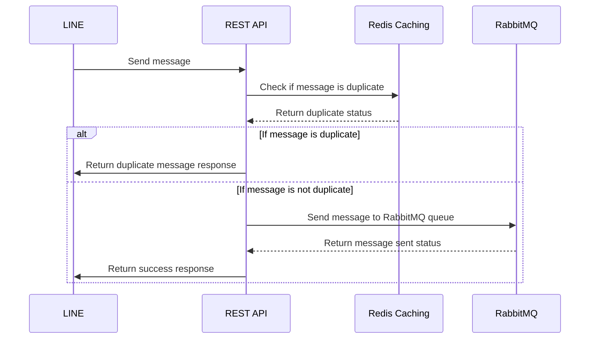

# REST API - Receive messages from LINE and Facebook Messenger

## Overview
Receive messages from LINE and Facebook Messenger, validate the message format/schema, and send the message to RabbitMQ queue.



## Workflow
1. Recieve message with LINE to API endpoint
2. Convert message to LINE message object
3. Validate message format/schema from system schema file
4. Send message to RabbitMQ queue
   - Queue name: `line-messages`

## Observability with OpenTelemetry
- Trace the entire workflow from receiving the message to sending it to RabbitMQ queue
- Log the message content and processing status at each step
- Monitor the performance of the API endpoint and RabbitMQ queue


## API Endpoint
- Endpoint: `POST /api/v1/line/messages`
- Request Body: LINE message object
```
{
  "to": "USER_ID",
  "messages": [
    {
      "type": "text",
      "text": "Hello, world!"
    }
  ]
}
```
- Response with success status and message ID
Code=200
```
{
  "status": "success",
  "messageId": "1234567890"
}
```

- Response with error status + request body if message format is invalid
Code=400
```
{
  "status": "error",
  "message": "Invalid message format"
}

- Response with error status + system down
Code=500
```
{
  "status": "error",
  "message": "System down"
}
```

## Input of LINE message object
* LINE message object

### LINE message object

Text Message Format
```json
{
  "to": "USER_ID",
  "messages": [
    {
      "type": "text",
      "text": "Hello, world!"
    }
  ]
}
```

Image Message Format
```json
{
  "to": "USER_ID",
  "messages": [
    {
      "type": "image",
      "originalContentUrl": "https://example.com",
      "previewImageUrl": "https://example.com"
    }
  ]
}
```

## RabbitMQ with Work Queues pattern 
- Queue name: `line-messages`

### Message format in RabbitMQ queue
```json
{
  "name": "line-messages",
  "message": {
    "to": "USER_ID",
    "messages": [
      {
        "type": "text",
        "text": "Hello, world!"
      }
    ]
  }
}
```

